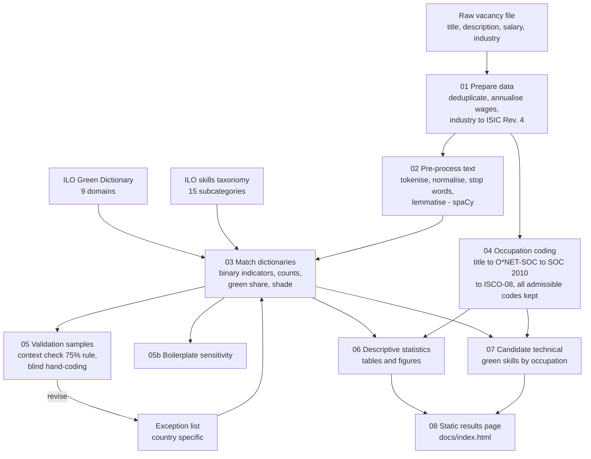

# Workflow

```mermaid
flowchart TD
    A[Raw vacancy file<br/>title, description, salary, industry] --> B[01 Prepare data<br/>deduplicate, annualise wages,<br/>industry to ISIC Rev. 4]
    B --> C[02 Pre-process text<br/>tokenise, normalise, stop words,<br/>lemmatise - spaCy]
    D[ILO Green Dictionary<br/>9 domains] --> E
    F[ILO skills taxonomy<br/>15 subcategories] --> E
    X[Exception list<br/>country specific] --> E
    C --> E[03 Match dictionaries<br/>binary indicators, counts,<br/>green share, shade]
    B --> G[04 Occupation coding<br/>title to O*NET-SOC to SOC 2010<br/>to ISCO-08, all admissible codes kept]
    E --> H[05 Validation samples<br/>context check 75% rule,<br/>blind hand-coding]
    H -->|revise| X
    E --> I[05b Boilerplate sensitivity]
    E --> J[06 Descriptive statistics<br/>tables and figures]
    G --> J
    E --> K[07 Candidate technical<br/>green skills by occupation]
    G --> K
    J --> L[08 Static results page<br/>docs/index.html]
    K --> L
```

Each box is one script in `src/`, numbered in execution order. Intermediate files live in `data/work/`
and are never committed; every table and figure in `output/` is an aggregate.
